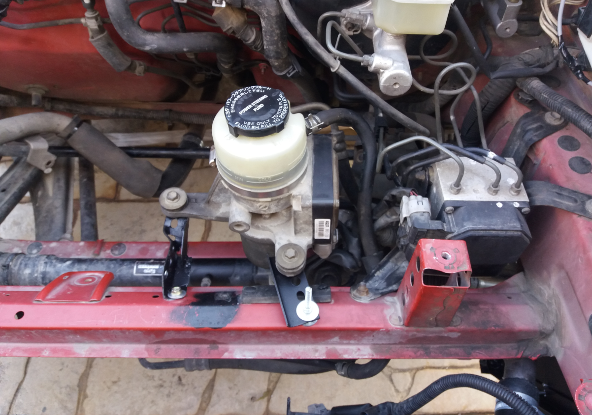

# Aero v1

## Intro
I spent the entire summer of 2023 building aero components for my zzw30. By entire summer I mean 1 to 1.5 hours a day 
from mid June to the start of August. Slow progress each day but by the end of this period I have crafted all the components
that I had in mind. Well, almost all :)

So let's see what I crafted.

## Front of the car

### Radiator
Up front, I started by tilting the radiator forward in order to have an angle "just like a WRC car". The idea is to 
help the air be extracted from the hood. All air will go up and through the hood, so the turbulent air underneath the car
will be reduced. The bracing and the hoses routing of the radiator had to be changed:

### Getting air in the radiator
The area behind the bumper has changed so that all the air goes through the radiator.

### Getting air out of the radiator
All the air (I hope) that gets through the radiator will exit at the top of the hood.
I made the openings as far at the front and away from the windshield as possible in order to
take advantage of the low pressure air of this area and achieve a good level of extraction.

The power steering pump was relocated in order for the "extraction box" to be installed.

And here are some shots of the hood openings.

### Splitter
The splitter is a fairly simple one. Completely flat with a small angle of attack of 1 degree.
The front lip from Luxurypart is used instead of an air dam. The splitter is made out of 12mm marine plywood.

In the making:

On the car:

## Bellow the car
I tried to cover as much of the area bellow the car as I could. I used 0.8 aluminum sheet for that and created bracing
that mounts on existing holes of the under-body.

## Rear of the car

### Diffuser
The under-body cover extends until the back of the car using 0.8mm aluminum sheet. At about 55cm form the edge of
the rear bumper, I used 1.4mm aluminum sheets to create a diffuser with 12* of angle at the left and right edges and 
quite less angle in the middle because of the layout of my exhaust.

In the making:

On the car:

<photo pending>

### Rear wing
I purchased I used wing and mounting pylons from an AW11 owner (thanks to the AW11 community) and 
made the necessary changes in order to mount it on the zzw30. The wing is a 9lives Big Wang 66" wide. 

