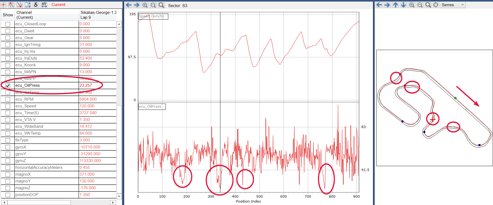
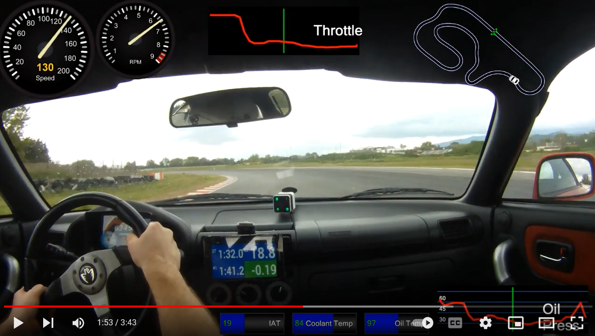
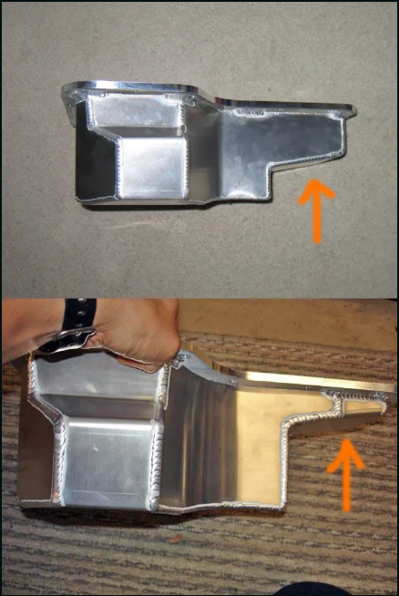

# Oil Pressure Drops

## Findings
When driving the car on track and despite the fact that I run a moroso oil pan on my 2zz I have observed that on
**left turns** there is significant pressure drop.
The pressure drops have been observed when reaching sustained lateral around 1.1g (no aero on the car).

The picture bellow shows this issue in a clear way:

As show above the oil pressure is ~55 to 60psi on the straights and right turns.
But on left turns it **goes down to 23psi**. The sustained lateral g of the car is about 1.1g.
The duration of the drop is also significant as it lasts about 2 seconds (obviously this depends on the track).
Similar observations have been found on other tracks as well.

Here you can see the problem in action (observe the oil pressure reading):

## Possible causes
I am using an older version of moroso pan. Also, I use the version that was usually sold to MR2 users.
This version is shallow in the side close to the gearbox and was made like that in order to fit the 
Celica cars with the 2zz engine. Also, this pan being an old design does not have the "diamond" baffles.

This picture shows the two "versions" of moroso pans:

I contacted moroso and here is their reply:

> There have been a handful of revisions done to the 20970 over the years so it is difficult to say what you have without seeing some photos of the inside and outside of the pan.
> All I can say is that the current design has a diamond type baffle in it to help with oil control going around turns in both directions.  For what it's worth, we do not typically get such complaints about this pan on the 1ZZ/2ZZ engines.  So it's very possible that you have a older version of this pan.

## Possible solutions

### Accusump
I could keep this pan and install an [accusump](https://www.cantonracingproducts.com/accusump). In theory this would solve the problem. 
But it will add complexity on the oiling system with more failure points. It would also add weight to the car.

### Oil Pan Upgrade
According to moroso [the newer versions](https://www.komo-tec.com/en/lotus-exige/mk2-toyota/engine-components/406/moroso-alloy-baffled-oil-pan-elise/exige-2zz) (~940e including shipping) of this pan do not suffer with similar problems. Other possible upgrades are 

* [InoKinetic GPAN3](https://www.inokinetic.com/eliseexige/gpan3) (~900e including shipping and import charges)
* [BOE Fabrications TOC v1.1](https://www.boefab.com/products/toc-wet-sump-oil-pan-v1-1) (~900e including shipping and import charges)

So maybe the best route should be to upgrade the pan and then if the problem persists to add an accusump in the system.