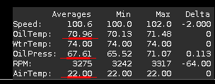
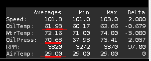

# Oil Temps with Different Underbody Configurations

## Test & Measurements done
Here I would like to compare the oil temps I observed during highway driving at around 100kph.
The "tests" include measurements with:

* My old oil pan (early model celica - compatible moroso) with and without the rear underbody cover **without openings**
* My new GPAN3 oil pan with out the underbody cover and with the cover **but with openings**

## Observations & Conclusions

1. The underbody **without openings** increased the oil temp by more than 10C*

Moroso / No underbody:

Moroso / Underbody without NACA ducts:

The temps with the closed underbody where +10 to +13 C* higher compared to the open underbody.
The logs of this measurement are lost due to a bug of my raspberrypi/python script so you have to take my word for it :)

2. The new oil pan lowered the oil temp by more than 10C*

3. The new oil pan increased the oil pressure a bit

4. With the underbody with NACA ducts and the new pan, the oil temps are...(TBD)

The first observation makes perfect sense. That's why I added the NACA ducts.

For the second one, I have no idea why this is happening! Could be the different location of
the temp sensor? The GPAN3 has the sensor at the firewall side, where the air hits the pan but 
I do not know if this causes the differential in the temperature readings (or if the temp really is
8C* lower).

For the third one, I also have no idea as for why. Could be a byproduct of the lowered oil temp.