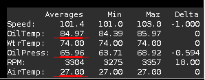
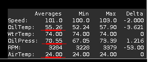
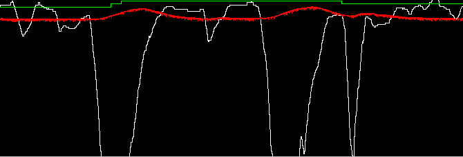

# Oil Temps with Different Underbody Configurations

## Test & Measurements done
Here I am comparing oil temps I observed during highway driving at around 100kph with different oil pans and under-body configurations.
The "tests" include measurements with:

* My old oil pan (early model, Celica-compatible, Moroso) without under-body cover and with the cover **completely closed**
* My new GPAN3 oil pan without the under-body cover and with the cover **having 3 NACA ducts**

## Observations & Conclusions

### 1. The under-body **without openings** increased the oil temp by more than 10C ###

Moroso / No underbody:

Moroso / With Underbody completely closed:

The temps with the closed underbody where +10 to +13C higher compared to the open underbody.
OK, the ambient temp was higher than the test above but still it is a significant increase in the oil temp.
This makes perfect sense since there was close to no air flow in the area.
That's why I added the NACA ducts.

### 2. GPAN3 lowered the oil temp by more than 10C & increased the oil press a bit ###

I have no idea why this is happening! Could be the different location of the temp sensor (the GPAN3 has the sensor at
the firewall side, where the air hits the pan) but I do not know if this affects the outcome.
Same for the pressure differential, I have no idea :), could be a byproduct of the lowered oil temp.

I believe that the increased pressure confirms that the oil temp is actually lower (and not a false reading due to the sensor location).

### 3. Oil temp with GPAN3 & the under-body having NACA ducts, is more or less the same with no under-body. ###
The temp in this test was actually even lower than the completely open under-body. But the ambient temp was lower in this test as you 
can see from the lower IAT.

So it looks like the NACA ducts work.

Another proof that the air flow from the NACA ducts actually does cooldown the oil is the following:

When stopped on traffic lights, the oil temp raised from ~55C to ~62C and then when I moved again the temp dropped to ~55C again
(red line: oil temp, white line: speed).

 

