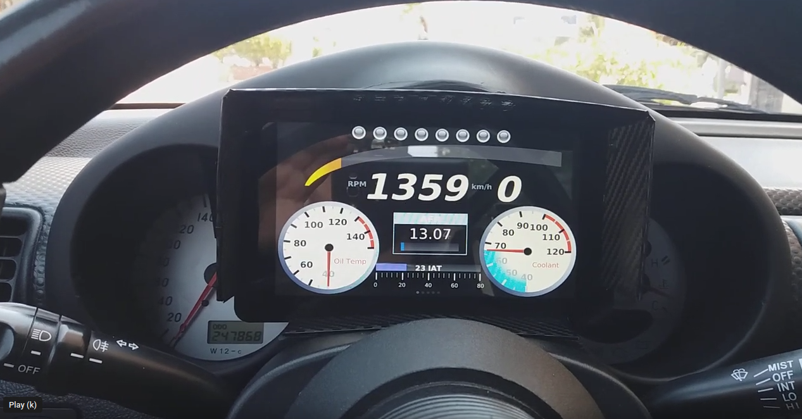
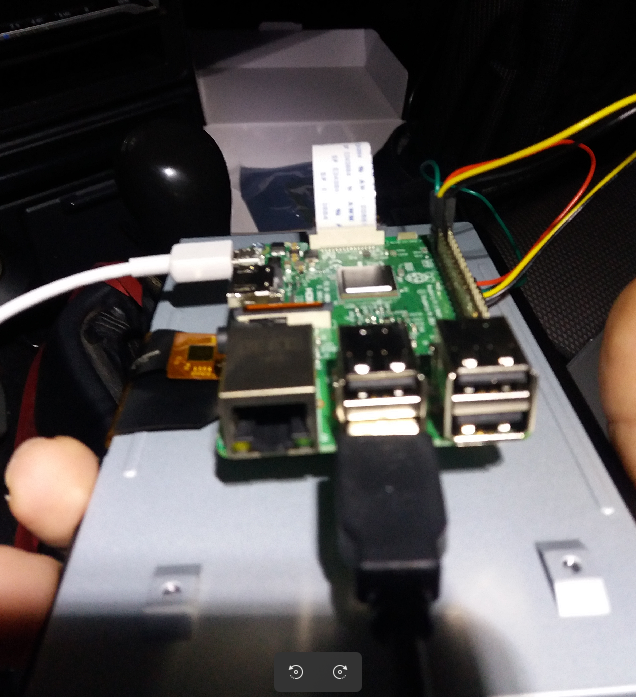
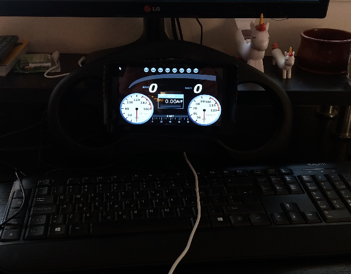
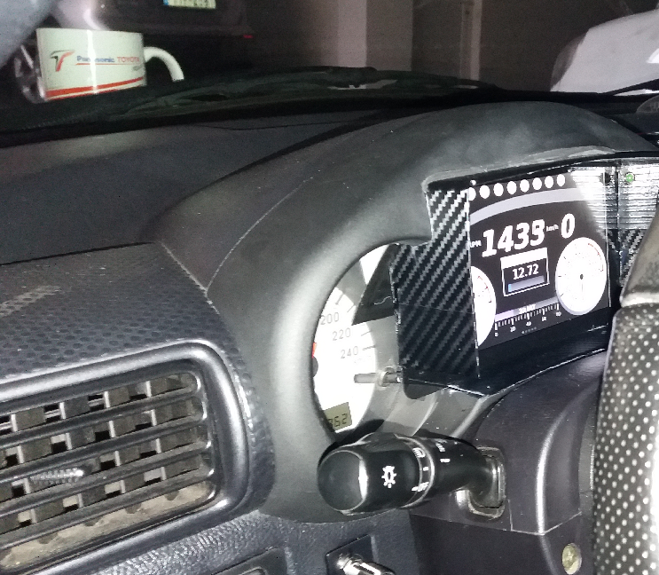

# Raspberry Pi dashboard and logger

## Intro
I used a raspberry pi in order to build a digital dashboard and logger for my zzw30.

Here is a video of the final product.

## Parts and implementation

The following parts are used:

* Raspberry Pi 3 - Model B
* Raspberry Pi 7" Touchscreen Display
* Memory Card microSDHC 64GB Class 10
* Two green LEDs

I purchased a used zzw30 dashboard and integrated the raspberry pi & screen on it. I have replaced the turn signals with two green LEDs because the factory turn signals are not visible anymore.

## Integration & Connectivity 
The car is equipped with an Apexi PFC standalone ecu and I also have the datalogit module installed. So I have connected
the raspberry pi via datalogit / usb to the ecu. The raspberry pi is powered up by a 12v to usb power source. Also, GPIO3 is connected to the
lights in order to dim the screen accordingly. Finally when GPIO17 goes low for some time (connected to a power source active when the key is in the "ON" position)
a python script is used to shut down gracefully the raspberry pi after uploading the logs to dropbox.

Check it out [here](https://github.com/sikrip/carpi).

## Software
I forked the [Powertune](https://github.com/sikrip/ApexiPowerTune) software, and I improved it a bit by adding the following:

* Supports both Gray(4 analog inputs) and Black(8 analog inputs) Datalogit versions
* Closed loop fuel adjustement via Wideband (can be switched on/off)
* Improved logging

## Alarms

I have created the following alarms:

* Rev limit
* Oil pressure
* Oil temp
* Water temp

 

