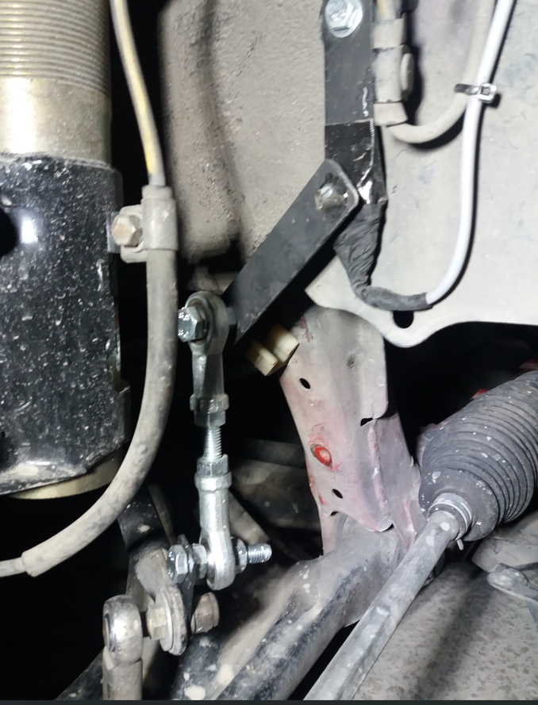
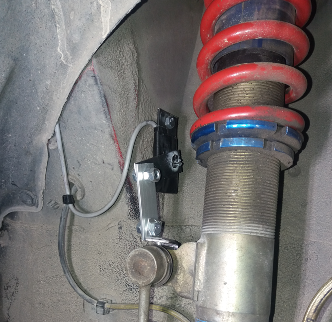
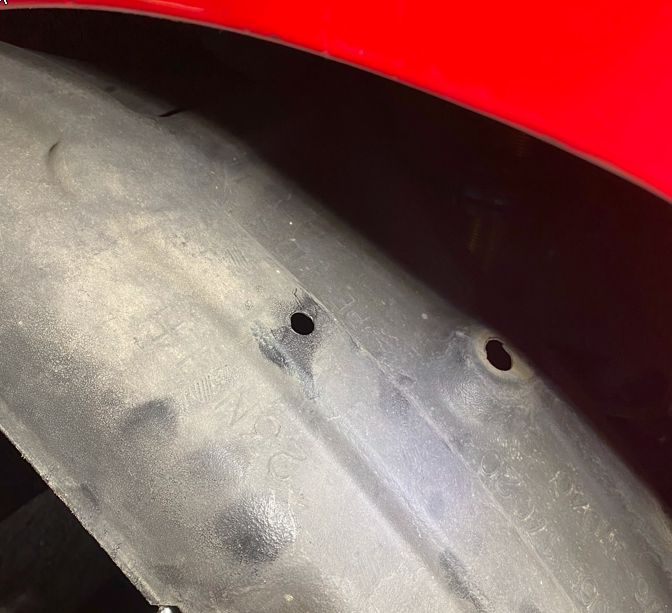
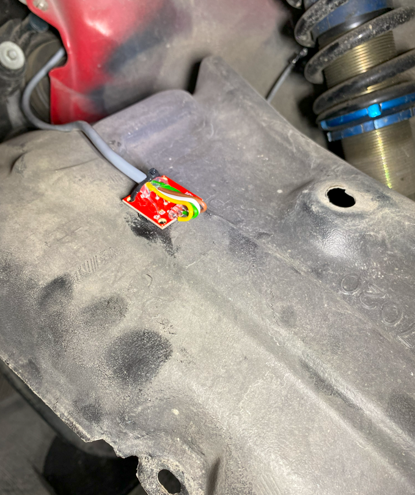
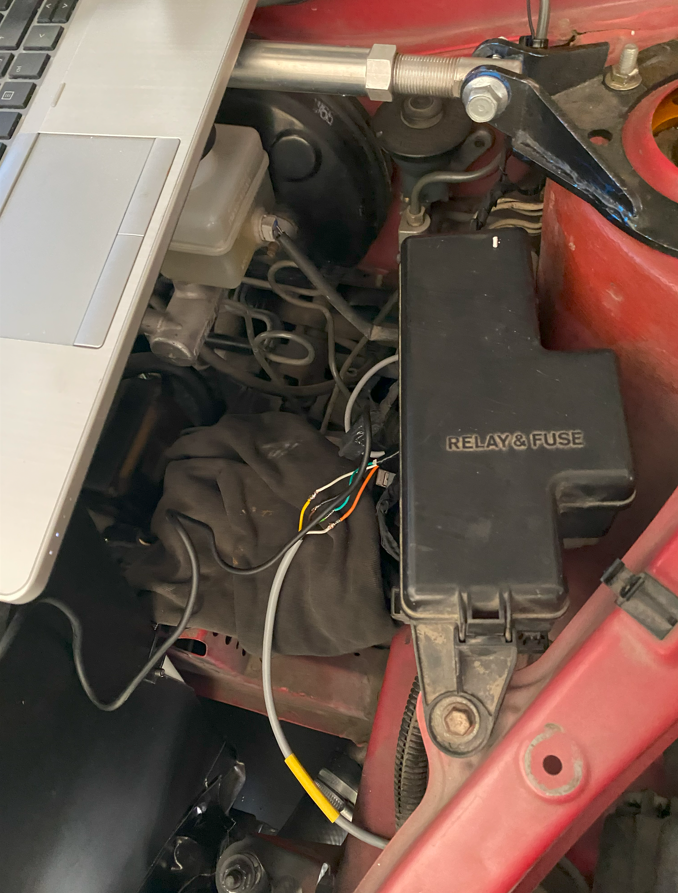
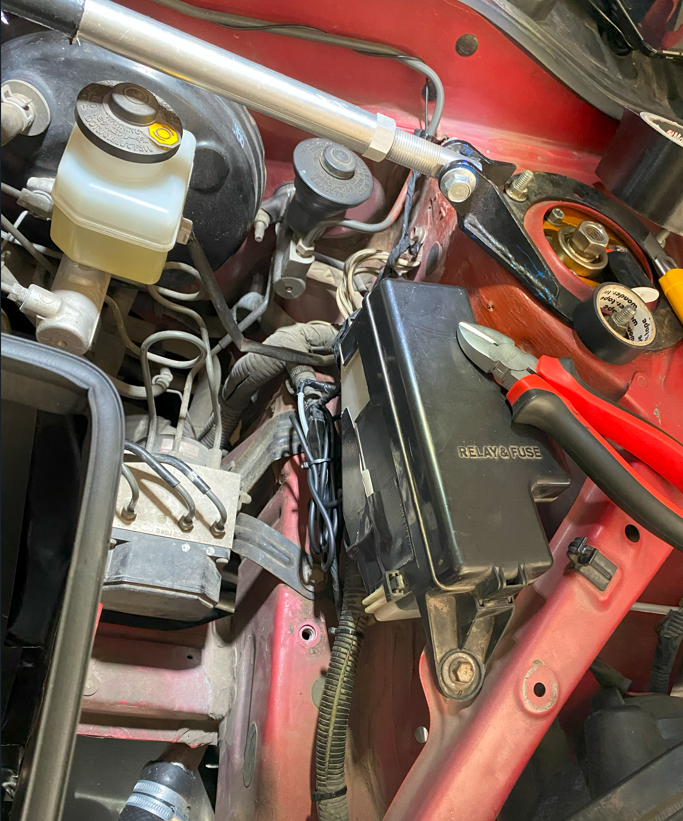
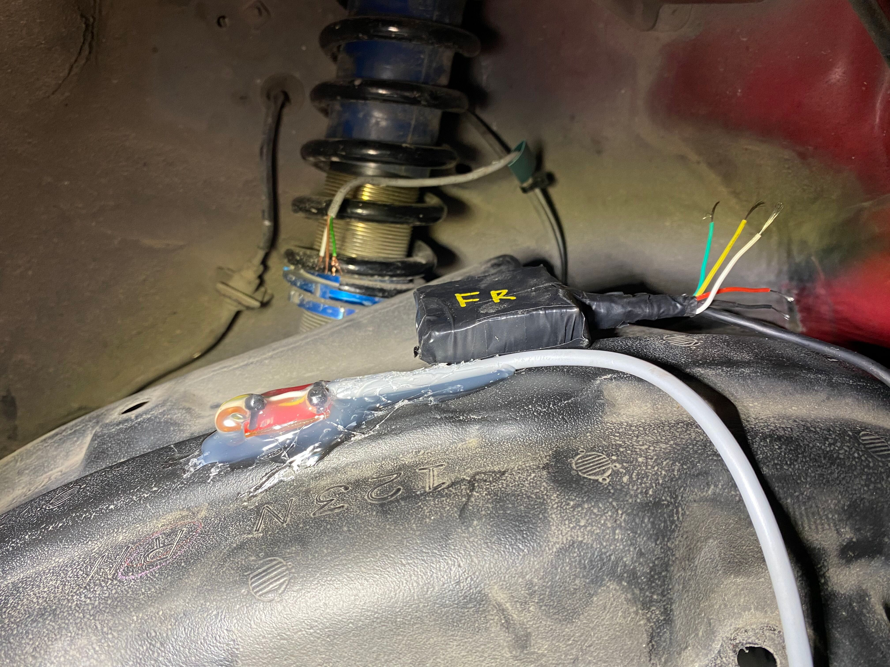
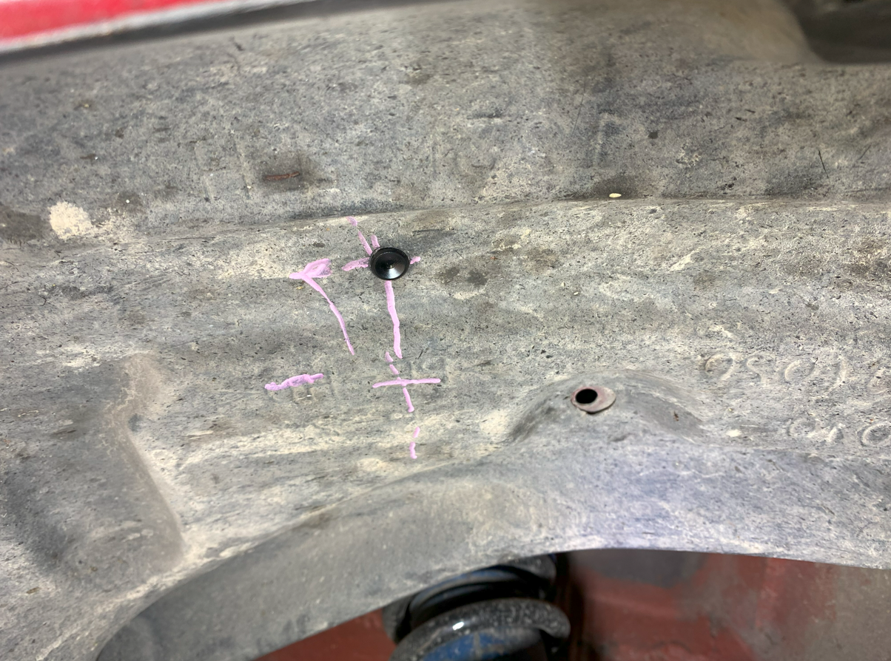
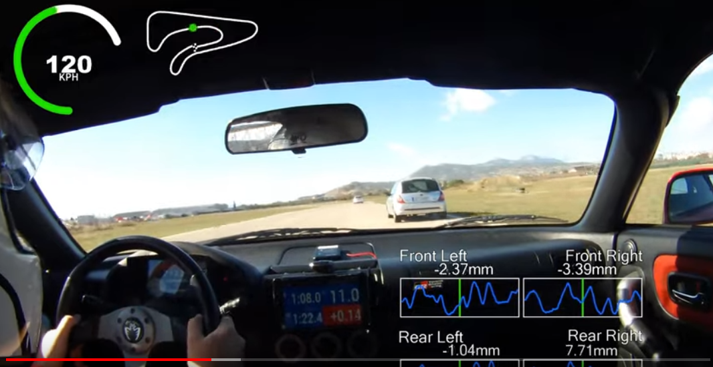
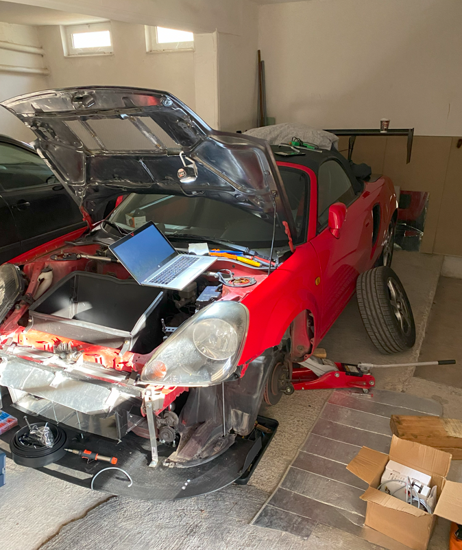

# Suspension travel & Tyre temps

## Intro
I implemented a slighlty different [RejsaRubberTrac](https://github.com/MagnusThome/RejsaRubberTrac) device that uses potentiometers in order to measure the suspension travel.
It also uses the newer MLX90640 sensor. 
The code can be found [here](https://github.com/sikrip/suspension-travel-RejsaRubberTrac).

## Suspension travel

I used one potentiometer for each corner of the car. Here are some photos of the installation:

**Front** (mounted on the lower control arm along with the antiroll bar link):

**Rear** (mounted on the strut along with the antiroll bar link):

## Tyre temps
I used one MLX90640 sensor for each corner of the car. The sensors are mounted in the top of the wheel so that
even with the wheels turned in front I will get reliable temp readings.

Here are some photos of the installation:

## Results
Here is a video of the suspension travel measurement in action:

Next time on track I will be able to check the tyre temps thing.

These are nice days folks!!!

